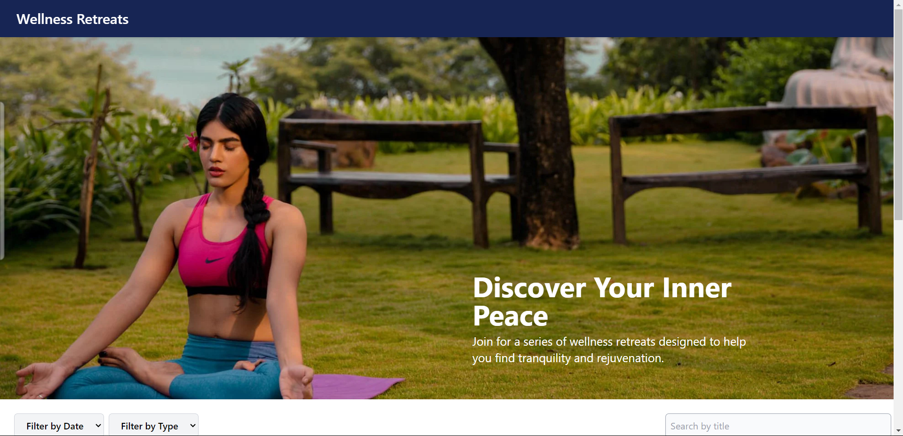

# Wellness Retreat

## Project Setup

1. **Clone the repository:**
    ```bash
   git clone https://github.com/yourusername/wellness-retreats.git
   cd wellness-retreats
2. **Install necessary dependencies**
    ```bash
    npm install
3. **Start application**
    ```bash
    npm run dev